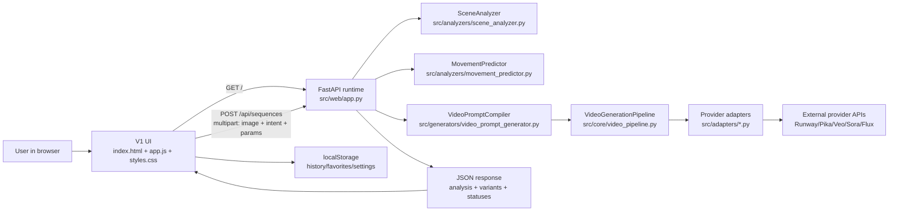

# Runtime architecture (as-built)

This document describes the current runtime architecture implemented in the
repository today. It focuses on the active FastAPI app in `src/web/app.py`.

## Canonical entrypoint

```bash
uvicorn src.web.app:app --host 0.0.0.0 --port 8000 --reload
```

## High-level flow

1. Browser loads UI from `GET /` served by `src/web/app.py`.
2. UI sends a real multipart request to `POST /api/sequences`.
3. Backend runs analysis and prompt compilation.
4. Backend executes provider generation when provider keys are configured.
5. Backend returns structured JSON that UI renders directly.

## Component map

- **Web runtime**
  - `src/web/app.py`
  - `src/web/static/index.html`
  - `src/web/static/app.js`
  - `src/web/static/styles.css`
- **Analyzers**
  - `src/analyzers/scene_analyzer.py`
  - `src/analyzers/movement_predictor.py`
- **Prompt compiler**
  - `src/generators/video_prompt_generator.py`
    (`VideoPromptCompiler`, request/control models)
- **Provider orchestration**
  - `src/core/video_pipeline.py`
  - `src/adapters/*.py` (runway, pika, veo, sora, flux)
- **Configuration**
  - `configs/scene_analyzer.json`
  - `configs/movement_prediction_rules.json`
  - `configs/video_prompting_catalog.json`

## Data flow diagram



## Routing notes

### Active runtime (`src/web/app.py`)

- `GET /`
- `GET /health`
- `GET /api/providers`
- `GET /api/presets`
- `POST /api/sequences`

### Legacy compatibility module (`src/web/api.py`)

The `src/web/api.py` module exists for compatibility only and is deprecated.
It is not the source of truth for runtime behavior.

## Status model

Execution states are explicit and non-simulated:

- `success`
- `failed`
- `not_configured`
- `not_executed`

If provider keys are missing, the backend still performs real analysis and
prompt compilation, then returns explicit non-success status and configuration
guidance.
